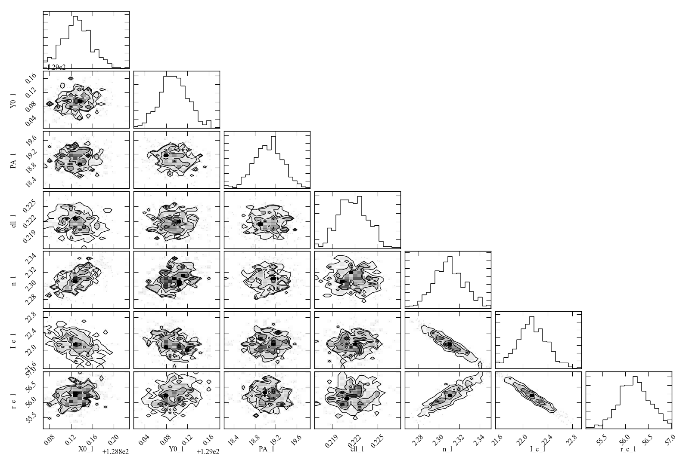

# Bootstrap Resampling for Parameter Uncertainties

When you call the `doFit` method on an Imfit object with the default Levenberg-Marquardt
solver, the solution automatically involves estimation of uncertainties on the best-fit
parameters, in the form of 1-sigma Gaussian errors. These are generally not very accurate
(they assume the fit-statistic landscape is quadratic) and do not include possible
correlations between uncertainties in different parameters.

## Bootstrap Resampling

A somewhat better (albeit more time-consuming) approach is to estimate the parameter
uncertainties -- including possible correlations between the values of different
parameters -- via bootstrap resampling.

You can do this by calling the `runBootstrap` method on an Imfit object -- ideally *after*
you've found a best-fit solution. E.g., assuming you've properly set up an Imfit object
and supplied it with the data image, etc.:

    imfitter.doFit()
    bootstrapResults = imfitter.runBootstrap(nIterations)

where `nIterations` is an integer specifying the total number of iterations (ideally
a minimum of several hundred).

This returns a 2D NumPy array which has one row per iteration, with each column contain the
collected values for a single parameter. The ordering of the parameter columns is the
same as in the model.

You can get a list of numbered parameter names by using the `getColumnNames` keyword:

    parameterNames, bootstrapResults = imfitter.runBootstrap(nIterations, getColumnNames=True)

`parameterNames` is a list of strings of the form ['X0_1', 'Y0_1', 'n_1', etc.]. The 'X0','Y0'
parameters are numbered by function set; all other parameters are numbered by function (so the
parameters of the very first function in the model have '_1' appended to their names, all parameters
from the second will have `_2` appended, and
so forth). This is make it possible to distinguish different
parameters when multiple versions of the same function, or just multiple functions
that have the same parameter names, are used in the model. (This numbering scheme is
exactly the same as used by the command-line program `imfit` in its bootstrap-output
files.)

### Analyzing the Results

One thing you can do, if the model is not *too* complicated, is
make a scatterplot matrix (a.k.a. corner plot) of the parameters. The
Python package [corner.py](https://corner.readthedocs.io/en/latest/) can be used for this;
here's a quick-and-dirty example:

	import corner
	
	corner.corner(bootstrapResults, labels=parameterNames)

A sample result is shown below (see the [Imfit tutorial](https://www.mpe.mpg.de/~erwin/code/imfit/markdown/index.html) 
for more about the data and model used to generate this figure).

**Figure 1:** Scatterplot matrix of parameter values from 500 rounds of bootstrap resampling
fits to an SDSS *r*-band image of the galaxy IC 3478 (single-S&eacute;rsic model, no PSF convolution).
Note the clear correlations between the S&eacute;rsic model parameters (*n*, *r\_e*,
*I\_e*).

## Using MCMC

Estimates of parameter uncertainties and correlations can also be obtained via
Markov-Chain Monte Carlo (MCMC) approaches. Although the MCMC option of **Imfit** (`imfit-mcmc`)
is not part of PyImfit, you *can* use instances of the Imfit class
with Python-based MCMC codes, such as [emcee](https://github.com/dfm/emcee); 
see [here](./pyimfit_emcee.html) for an example.
