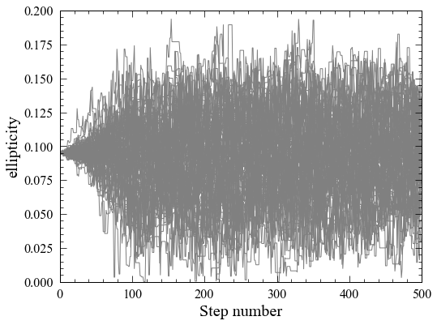
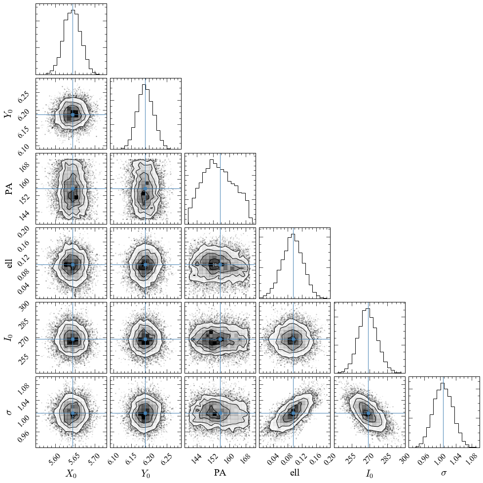

# Example of using PyImfit with Markov-Chain Monte Carlo code "emcee"

This is a Jupyter notebook demonstrating how to use PyImfit with the MCMC code emcee.

If you are seeing this as part of the readthedocs.org HTML documentation, you can retrieve the originaly .ipynb file
[here](https://github.com/perwin/pyimfit/blob/master/docs/pyimfit_emcee.ipynb).

Some initial setup for nice-looking plots:


```python
%pylab inline

matplotlib.rcParams['figure.figsize'] = (8,6)
matplotlib.rcParams['xtick.labelsize'] = 16
matplotlib.rcParams['ytick.labelsize'] = 16
matplotlib.rcParams['axes.labelsize'] = 20
```

    Populating the interactive namespace from numpy and matplotlib


    /Library/Frameworks/Python.framework/Versions/3.7/lib/python3.7/site-packages/IPython/core/magics/pylab.py:160: UserWarning: pylab import has clobbered these variables: ['mean']
    `%matplotlib` prevents importing * from pylab and numpy
      "\n`%matplotlib` prevents importing * from pylab and numpy"


### Create image-fitting model using PyImfit

Load the pymfit package; also load astropy.io.fits so we can read FITS files:


```python
import pyimfit
from astropy.io import fits
```

Load data image (in this case, a small cutout of an SDSS image showing a faint star), applying a correction to ensure that the data values in the resulting numpy array are little-endian and double-precision:


```python
imageFile = "/Users/erwin/coding/imfit/tests/faintstar.fits"
image_faintstar = pyimfit.FixImage(fits.getdata(imageFile))
```

Create a ModelDescription instance based on an imfit configuration file (which specifyies a single elliptical Gaussian model):


```python
configFile = "/Users/erwin/coding/imfit/tests/imfit-mcmc_reference/config_imfit_faintstar.dat"
model_desc = pyimfit.ModelDescription.load(configFile)
```

Alternately, you can create the ModelDescription programmatically from within Python:


```python
# create a SimpleModelDescription instance (one function block); specify the x0,y0 center for the function block.
model_desc = pyimfit.SimpleModelDescription()
model_desc.x0.setValue(5.0, [3.0,8.0])
model_desc.y0.setValue(6.0, [3.0,8.0])
# create a Gaussian image function for the star and set its parameters
star = pyimfit.make_imfit_function("Gaussian")
star.PA.setValue(155, [140,170])
star.ell.setValue(0.1, [0,0.3])
star.I_0.setValue(250, [220,320])
star.sigma.setValue(1.0, [0.1,1.5])
# now add the image function to the model
model_desc.addFunction(star)
```

Create an Imfit instance containing the model, and add the image data and image-description info:


```python
imfit_fitter = pyimfit.Imfit(model_desc)
imfit_fitter.loadData(image_faintstar, gain=4.72, read_noise=1.15, original_sky=124.94)
```

Fit the model to the data (using the default Levenberg-Marquardt solver) and extract the best-fitting parameter values
(X0, Y0, PA, ellipticity, I_0, sigma):


```python
imfit_fitter.doFit()
p_bestfit = imfit_fitter.getRawParameters()

print("Best-fitting parameter values:")
for i in range(len(p_bestfit) - 1):
    print("{0:g}".format(p_bestfit[i]), end=", ")
print("{0:g}\n".format(p_bestfit[-1]))
```

    Best-fitting parameter values:
    5.64339, 6.18794, 155.354, 0.0950157, 268.92, 1.00772
    


### Define log-probability functions for use with emcee

Emcee requires a function to calculate the log of the posterior probability (using the likelihood and the prior probability).

We'll create a general function for the posterior probability which takes as input the current model parameters, an Imfit instance which computes the fit statistic for those parameters (= $-2 \: \times$ log likelihood) and a user-supplied function for computing the prior; this will return the sum of the log likelihood and the log of the prior:


```python
def lnPosterior_for_emcee( params, imfitter, lnPrior_func ):
    """
    Returns log of posterior probability (which is calculated as the
    product of the specified prior and the likelihood computed by the
    Imfit object using the specified parameter values).
    
    Parameters
    ----------
    imfitter : Imfit instance
    
    lnPrior_func : function or other callable
        Should compute and return log of prior probability
        signature = lnPrior_func(parameter_vector, Imfit_instance)
    
    Returns
    -------
    logPosterior : float
    """
    lnPrior = lnPrior_func(params, imfitter)
    if not np.isfinite(lnPrior):
        return -np.inf
    lnLikelihood = -0.5 * imfitter.computeFitStatistic(params)
    return lnPrior + lnLikelihood
```

Now, we'll create a prior-probability function.

For simplicity, we'll use the case of constant priors within parameter limits, with the parameter limits obtained from a user-supplied Imfit instance.


```python
def lnPrior_limits( params, imfitter ):
    """
    Defines prior-probability distributions as flat within specified limits.
    If any parameter is outside the limits, we return -np.inf; otherwise, we
    return ln(1.0) = 0 (not strictly speaking a correct probability, but it
    works for this case).
    
    Parameters
    ----------
    params : sequence of float
    
    imfitter : Imfit instance
    
    Returns
    -------
    logPrior : float
    """
    parameterLimits = imfitter.getParameterLimits()
    if None in parameterLimits:
        raise ValueError("All parameters must have lower and upper limits.")
    nParams = len(params)
    for i in range(nParams):
        if params[i] < parameterLimits[i][0] or params[i] > parameterLimits[i][1]:
            return -np.inf
    return 0.0
```

### Set up and run Markov-Chain Monte Carlo using emcee

Import [emcee](http://dfm.io/emcee/current/), and also [corner](https://corner.readthedocs.io/en/latest/) (so we can make a nice plot of the results):


```python
import emcee
import corner
```

Specify the number of dimensions (= number of parameters in the model) and a large number of walkers, then instantiate
a standard emcee sampler, using our previously defined posterior function (the Imfit instance containing the data and model and the simple prior function are provided as extra arguments):


```python
ndims, nwalkers = 6, 100

sampler = emcee.EnsembleSampler(nwalkers, ndims, lnPosterior_for_emcee, args=(imfit_fitter, lnPrior_limits))
```

Define some initial starting values -- 0.1% Gaussian perturbations around the previously determined best-fit parameters:


```python
initial_pos = [p_bestfit * (1 + 0.001*np.random.randn(ndims)) for i in range(nwalkers)]
```

Run the sampler for 500 steps (reset it first, in case we're running this again, to ensure we start anew):


```python
sampler.reset()
final_state = sampler.run_mcmc(initial_pos, 500)
```

Plot values from all the walkers versus step number to get an idea of where convergence might happend
(here, we just plot the ellipticity and I_0 values):


```python
def PlotAllWalkers( sample_chain, parameterIndex, yAxisLabel ):
    nWalkers = sample_chain.shape[0]
    for i in range(nWalkers):
        plot(sample_chain[i,:,parameterIndex], '0.5')
    xlabel('Step number')
    ylabel(yAxisLabel)

PlotAllWalkers(sampler.chain, 3, 'ellipticity')
```





```python
PlotAllWalkers(sampler.chain, 4, 'I_0')
```


Define the "converged" subset of the chains as step numbers $\ge 200$, and merge all the individual walkers:


```python
converged_samples = sampler.chain[:, 200:, :].reshape((-1, ndims))
print("Number of samples in \"converged\" chain = {0}".format(len(converged_samples)))
```

    Number of samples in "converged" chain = 30000


### Corner plot of converged MCMC samples

Define some nice labels and parameter ranges for the corner plot:


```python
cornerLabels = [r"$X_{0}$", r"$Y_{0}$", "PA", "ell", r"$I_{0}$", r"$\sigma$"] 

x0_range = (5.55, 5.73)
y0_range = (6.09, 6.29)
pa_range = (138,173)
ell_range = (0, 0.2)
i0_range = (240,300)
sig_range = (0.92, 1.1)
ranges = [x0_range, y0_range, pa_range, ell_range, i0_range, sig_range]
```

Make a corner plot; blue lines/points indicate best-fit values from above. [Note that we have to explicitly capture the Figure instance returned by corner.corner, otherwise we'll get a duplicate display of the plot]:


```python
fig = corner.corner(converged_samples, labels=cornerLabels, range=ranges, truths=p_bestfit)
```





Note that the PA values are running up against our (rather narrow) limits for that parameter, so a next step
might be to re-run this with larger PA limits.
